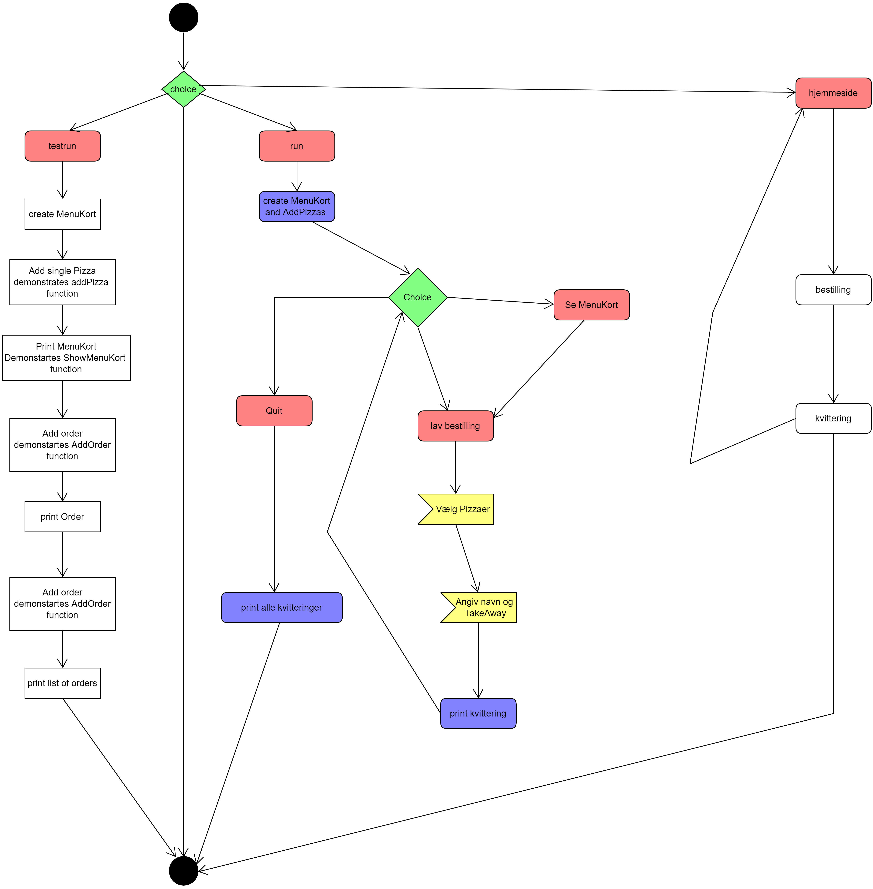

# BIG MOMMAS PIZZA CASE

## Beskrivelse
---------------
Systemet er en prototype på et Ordering/Booking system til Pizzariaet Big Mommas Gastronomia.
Det kan bruges af både personale til at modtage ordrer enten over telefon eller ved personligt fremmøde. 
Med videreudvikling vil det også kunne bruges på en hjemmeside, hvor brueren selv lægger ordrer ind i systemet. 

## Indhold
-------------
Systemet er baseret på object orienteret programmering, og indeholder 3 filer med 3 forskellige klasser:

- MenuKort 
    - En klasse der der indeholder en liste over Pizza'er samt en liste over modtagne ordrer.
    - KLassen har derudover metoderne til at tilføje pizza'er og order til de respektive lister samt at printe det fulde Menu kort.
    - Til test forsøg indeholder klassen også metoder til at autogenerere et Menu kort bestående af simple tilfældigt sammensatte pizzaer.
    - Funktionalitet: det er igennem denne klasse at vi opretter nye pizzaer i systemet og optager nye ordrer fra kunder  

- TakeOrder 
    - en klasse der indeholder attributter med oplysninger relevante for hver ordre. Herunder ID, Navn, Pizzaer, takeaway (yes/no), samt ordens fulde pris.  
    - Klassen har en metode til at udregne ordrens fulde pris, og en metode til at printe en kvittering for ordren
    - et objekt af denne type oprettes via MenuKortets tilføj ordre metode og samtlige ordrer der er indgivet i systemet er gemt i MenuKortets ordre-katalog. 
    - Funktionaliteten for denne klasse er derfor primært at holde styr på relevant info for hver ordre og at udskrive kvittering 
    - ved print af kvittering benyttes modulet datetime til at få dags dato. 

- Pizza
    - Pizza klassen indeholder de relevante oplysnionger for hver pizza. Herunder pris, topping, navn og bestillings nr. 
    - klassen har metoder til at hente pris og navn for enkelte pizzaer, som bruges af TakeOrder klassen ved print af kvittering. Derudover findes en metode til at printe alt pizzaens information, som bruges af klassen MenuKort når det fulde menukort skal printes
    - et objekt af denne type oprettes igennem MenuKortets tilføj pizza funktion, og samtlige Pizzaer der er gemt i systemet er indeholdt i Menu Kortets pizza-katalog

Til sidst indeholder systemet en fil (BigMommas.py) til at der kører hele systemet. Det er fra denne fil man arbejder med ovennævnte klasser.  
- funktionalitet:
    - når systemet køres vælges der mellem et "test run" eller et "run"
        - et "test run" tjekker kun at metoder og klasser virker.  
        - et "run" er et fuldt run af hele systemet. 
        - en  "hjemmeside" der kører en hjemmeside applikation

## FLOW
---------
Systemet kører under et while-loop og afsluttes først når brugeren ønsker det. Derfor vendes der tilbage til start ved endt transaktion.  
Når systemet kører er "flowet" således:
- brugeren bydes velkommen og får muligheden for at se menukort / gå direkte til ordre bestilling / eller at afslutte programmet. 
    - vælger man at se menukortet printes dette og man er derefter klar til at modtage bestilling
    - går man direkte til bestilling spørges brugeren efter nummeret på den ønskede pizza. det er muligt at bestille flere pizzaer i en ordre, ved at indtaste gyldige numre efterfulgt af enter. for at gå videre indtastes F=finish.
    Der er indlagt input checks således at systemet holder sig kørende ved forkerte inputs
    - for at færdiggøre bestillingen indtastes der navn og om man ønsker take away
    - Derefter printes den pågældende bestilling
- Ved afslutning af systemet printes det fulde ordre katalog og systemet er derefter klar til en ny dag. 

## TO-DO
---------
Da systemet er en prototype kan der i den grad stadig tilføres megen funktionalitet.

- systemet sælger kun pizzaer, og der kunne tilføres andre madprodukter (desserter(tiramisu), dagens-ret) og drikkevarer
- systemet tillader ikke nogen ændringer på pizzaens sammensætning hence ingen "ekstra ost"
- systemet indeholder ikke noget klub medlemskab der giver rabat
- systemet tillader heller ikke noget levering da der ikke spørges efter nogen adresse  

## Class-Diagram
------------------
 

 ## Activity Diagram
 --------------------

 ## Sequence Diagram
 --------------------